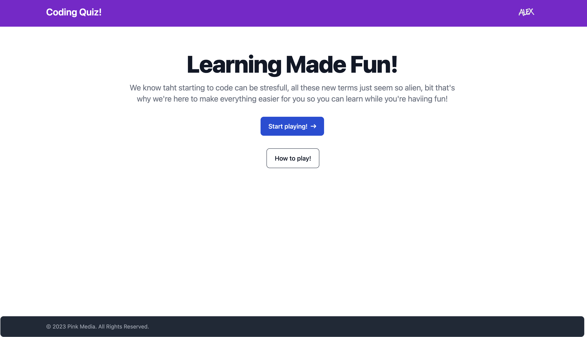
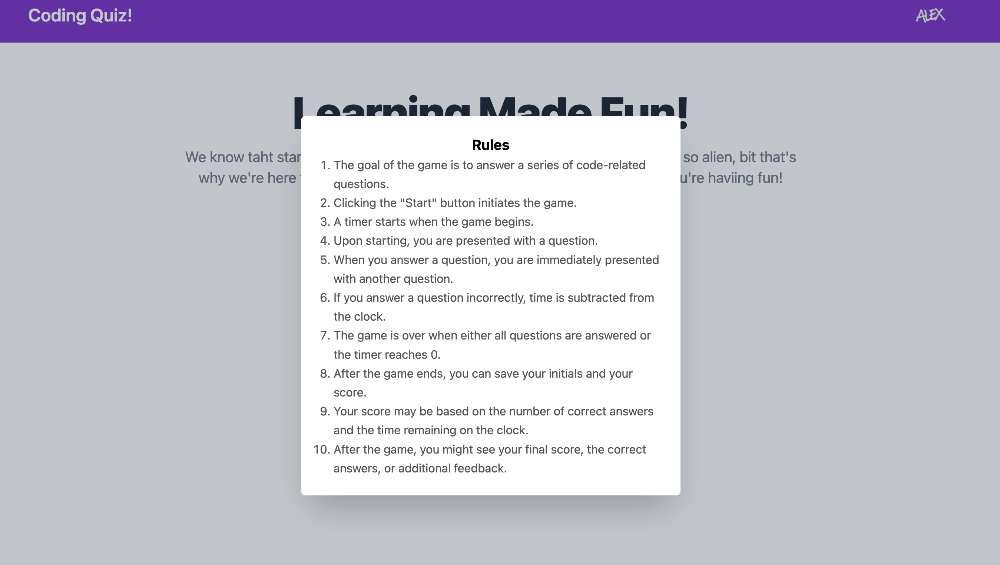
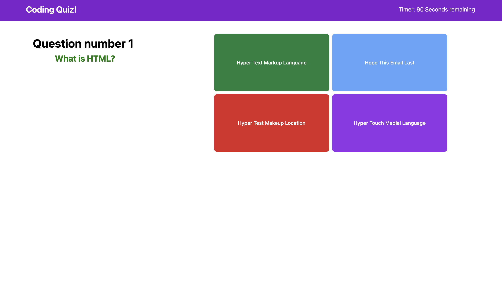
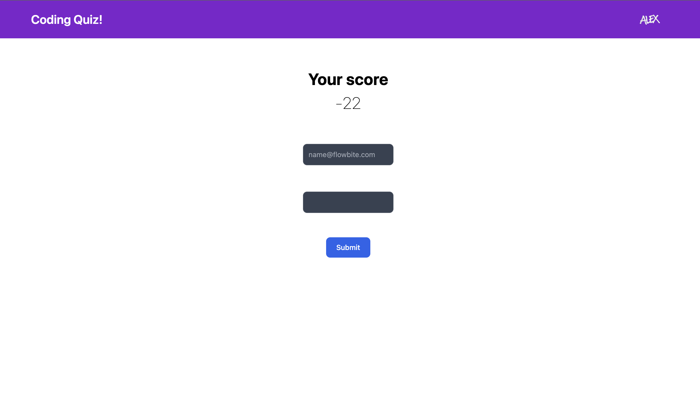

# Coding quiz
by cidherp2

## Table of Contents

*[Description](#description)

*[Installation-instructions](#installation)

*[Usage](#usage)

*[License](#license)

*[Contribution](#contribution)

*[Tests](#test)

*[Questions](#questions)
* [License](#license)

## Description
A simple coding quiz to make learning more fun and digestible
## Installation-instructions
just open the webpage 
## Usage
Click the start button and answer the questions!

## License
ISC
## Contribution
There are none
## Tests
No testing instructions for this proyect 
## Have any more questions?
You can reach me here
    Git Hub: cidherp2
    email: alexlarios70@hotmail.com
## License
        Licensed under the ISC license
